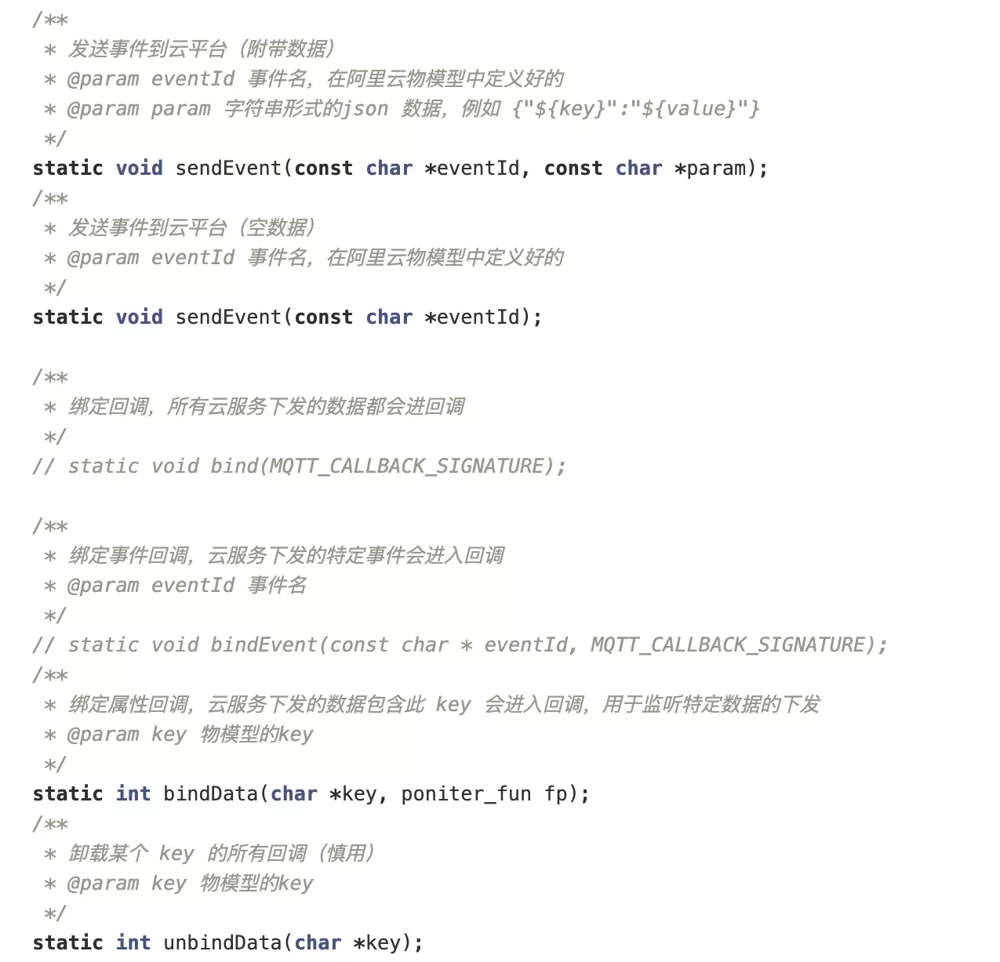

代码注释

# 代码注释



## 1. 注释案例

[1.1 JS注释案例](%E4%BB%A3%E7%A0%81%E6%B3%A8%E9%87%8A%207d37ad12627e4d86bf5f80067f41a960/1%201%20JS%E6%B3%A8%E9%87%8A%E6%A1%88%E4%BE%8B%2081334e2170c249b7ae387abf2e9d2a50.md)

[1.2 python注释](%E4%BB%A3%E7%A0%81%E6%B3%A8%E9%87%8A%207d37ad12627e4d86bf5f80067f41a960/1%202%20python%E6%B3%A8%E9%87%8A%206310c4ba56cc4daead6ae85ebd9bbf62.md)

[1.3 HTML及相关格式 注释](%E4%BB%A3%E7%A0%81%E6%B3%A8%E9%87%8A%207d37ad12627e4d86bf5f80067f41a960/1%203%20HTML%E5%8F%8A%E7%9B%B8%E5%85%B3%E6%A0%BC%E5%BC%8F%20%E6%B3%A8%E9%87%8A%20cd8177e677b148708a11e928e7b0db99.md)

## 2. 注释写法规范

### 1.1 文件头注释

- 位于文件头部，一般包含概要、作者、版本改动信息以及修改时间等内容

```
  /*
   * 简述当前文件功能
   * @author 作者名称
   * @version 版本号 最近编辑时间
   * @description 该版本改动信息
   */
```

### 1.2 函数注释

- 其间每一行都以 *``开头，且与第一行第一个 * ``对齐
- 注释内容与 *`` 间留一个空格
- 必须包含标签注释。例：

```jsx
/**
* 方法说明
* @method 方法名
* @for 所属类名
* @param {参数类型} 参数名 参数说明
* @return {返回值类型} 返回值说明
*/
```

```jsx
/**
 * @func
 * @desc 一个带参数的函数
 * @param {string} a - 参数a
 * @param {number} b=1 - 参数b默认值为1
 * @param {string} c=1 - 参数c有两种支持的取值  1—表示x  2—表示xx
 * @param {object} d - 参数d为一个对象
 * @param {string} d.e - 参数d的e属性
 * @param {object[]} g - 参数g为一个对象数组
 * @param {string} g.h - 参数g数组中一项的h属性
 * @param {string} [j] - 参数j是一个可选参数
 */
 function foo(a, b, c, d, g, j) {}

/**
 * @func
 * @desc 一个带若干参数的函数
 * @param {...string} a - 参数a
 */
function bar(a) {}
```

### 注释常用标签用法

- @type {typeName}
  - * 表示任何类型
  - `?` 表示可以为 `null`
  - `!` 表示不能为 `null`
  - `[]` 表示数组

```
/**
* @type {number}
*/
var foo1;

/**
* @type {*}
* @desc 任何类型
*/
var foo2;

/**
* @type {?string}
* @desc string或者null
*/
var foo3;

```

- @param {<type>} name - some description
  - 非必传参数需给参数名加上 `[]`
  - 参数如有默认值需用 `=` 表示
  - 如果参数是 Object，可继续用 `@param` 对其属性进行详细说明
  - 若干个参数用 `...` 表示

了解更多可查看 [JSDoc](http://yuri4ever.github.io/jsdoc/)

### 1.3 代码注释

- 单行注释
  - 总是在 `//` 后留一个空格

```
  // 这是一行注释
```

- 多行注释
  - 总是保持星号纵向对齐（结束符前留一个空格）
  - 不要在开始符、结束符所在行写注释
  - 尽量使用单行注释代替多行注释
  - 注释函数时，推荐使用多行注释

```
  /*
    这里有一行注释
    这里有一行注释
    这里有一行注释
   */
```

## 2. 特殊标记注释

```
// TODO功能未完成，待完善
// FIXME  待修复
// XXX    实现方法待确认
// NOTE   代码功能说明
// HACK   此处写法有待优化
// BUG    此处有 Bug
const arr = []
```

- **TODO**

在该注释处有功能代码待编写，待实现的功能在说明中会简略说明

- **FIXME**

在该注释处代码需要修正，甚至代码是错误的，不能工作，需要修复，如何修正会在说明中简略说明

- **XXX**

在该注释处代码虽然实现了功能，但是实现的方法有待商榷，希望将来能改进，要改进的地方会在说明中简略说明

- **NOTE**

在该注释处说明代码如何工作

- **HACK**

在该注释处编写得不好或格式错误，需要根据自己的需求去调整程序代码

- **BUG**

在该注释处有 Bug

Tips：

- 单行注释为什么有时候写在代码上方，有时候写在代码后方？

  一般写在代码上方的时候意为对后面一段代码的注释，

  而写在代码后方的时候意为对本行代码的注释。

### 注释相关插件

在这里推荐几个个人认为比较好用的注释相关的 Vscode 插件，可在 `setting.json` 文件下自定义设置（可通过 '文件—首选项—设置'，打开 Vscode 文件 `settings.json` ）

- [koroFileHeader](https://marketplace.visualstudio.com/items?itemName=OBKoro1.korofileheader) 在vscode中用于生成文件头部注释和函数注释的插件
- **文件头部添加注释**
  - 在文件开头添加注释，记录文件信息/文件的传参/出参等
  - 支持用户高度自定义注释选项, 适配各种需求和注释。
  - 保存文件的时候，自动更新最后的编辑时间和编辑人
  - 快捷键：`window`：`ctrl+alt+i`，`mac`：`ctrl+cmd+i`，`linux`：`ctrl+meta+i`
- **在光标处添加函数注释**
  - 在光标处自动生成一个注释模板
  - 支持用户高度自定义注释选项
  - 快捷键：`window`：`ctrl+alt+t`，`mac`：`ctrl+cmd+t`，`linux`：`ctrl+meta+t`
  - 快捷键不可用很可能是被占用了，[参考这里](https://github.com/OBKoro1/koro1FileHeader/issues/5)
  - 可自定义默认参数
- [Better Comments](https://marketplace.visualstudio.com/items?itemName=aaron-bond.better-comments) 通过使用警报，信息，TODO 等进行注释来改善代码注释。使用此扩展，您将能够将注释分类为：
  - 快讯
  - 查询
  - 待办事项
  - 强调
  - 注释掉的代码也可以设置样式，以使代码不应该存在
  - 可自定义指定其他所需的注释样式
- [TODO Highlight](https://marketplace.visualstudio.com/items?itemName=wayou.vscode-todo-highlight) 突出显示TODO，FIXME和任何关键字
  - 高亮内置关键字，可通过自定义设置覆盖外观
  - 也可自定义关键字

### 用事实说话

口说无凭，眼见为实。下面我们看下实际开发中的具体情况：

- 没有注释

```
const noWarehousetemIds = beSelectSkucontainer.reduce((arr, itemId) => {
    const res = Object.keys(selectRowskey[itemId]).every((skuId) => {
      const sku = selectRowskey[itemId][skuId];
      return !!sku.warehouseCode || lodashGet(warehouses, '[0].code');
    });
    if (!res) {
      arr.push(itemId);
    }
    return arr;
  }, []);
  if (noWarehousetemIds.length > 0 || noStockItemIds.length > 0) {
    const itemIds = Array.from(new Set([...noWarehousetemIds, ...noStockItemIds]));
    const itemNames = itemIds.map(i => this.itemNameMap[i].itemName);
    return Modal.warning({
      title: '错误提示',
      content: `“${itemNames.join(',')}”库存信息未完善，请完善库存信息`,
    });
  }
```

- 一般般的注释

```
// 遍历当前所有选中的sku，查找出没有库存的itemId
const noStockItemIds = beSelectSkucontainer.reduce((arr, itemId) => {
  const res = Object.keys(selectRowskey[itemId]).every((skuId) => {
    const sku = selectRowskey[itemId][skuId];
    return !!sku.stockQuantity;
  });
  if (!res) {
    arr.push(itemId);
  }
  return arr;
}, []);
// 有一条sku的库存为空时进入校验
if (noStockItemIds.length > 0) {
  const itemNames = itemIds.map(i => this.itemNameMap[i].itemName);
  return Modal.warning({
    title: '错误提示',
    content: `“${itemNames.join(',')}”库存信息未完善，请完善库存信息`,
  });
}
```

- 更好的注释

```
// 遍历当前所有选中的sku，查找出没有库存的itemId
const noStockItemIds = beSelectSkucontainer.reduce((arr, itemId) => {
    // selectRowskey是一个对象，以itemId为key，sku对象作为value，sku对象以skuId作为key，sku作为value，只有selectRowskey下所有itemId下的sku都有库存才算校验通过
    /*
        数据格式:
        selectRowskey: {
          12345678: { // itemId
              123456: { // skuId
              name: 'sku',
              }
          }
        }
      */
    const res = Object.keys(selectRowskey[itemId]).every((skuId) => {
        const sku = selectRowskey[itemId][skuId];
        return !!sku.stockQuantity;
    });
    // 只要有一条sku没有库存时，就塞到arr中，返回给noStockItemIds数组
    if (!res) {
        arr.push(itemId);
    }
    return arr;
}, []);
// 有一条sku的库存为空时进入校验
if (noStockItemIds.length > 0) {
    // 根据id查找商品名称
    const itemNames = itemIds.map(i => this.itemNameMap[i].itemName);
    Modal.warning({
        title: '错误提示',
        content: `“${itemNames.join(',')}”库存信息未完善，请完善库存信息`,
    });
}
```

看到上面这段代码可以很明显的体会到有没有注释以及注释写的清不清楚的重要性。若是写了注释但仍然看不懂，那还不如不写。

所以注释也不是随便写一写就可以的，要描述某段代码的功能，注明逻辑，让开发者可以”无脑“浏览。

之前在工作群中看到有人发过这样一张图（如下图），个人认为是一个很好的代码注释的范例：